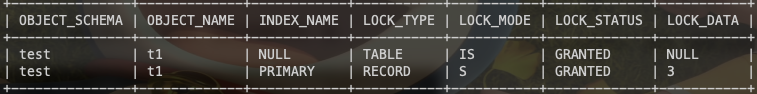
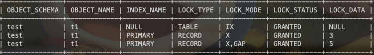
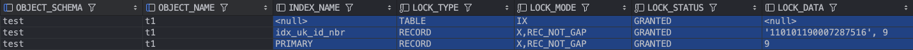

## 引言

本文是对MySQL行级锁的学习，MySQL一直停留在会用的阶段，需要弄清楚锁和事务的原理并DEBUG查看。

PS:本文涉及到的表结构均可从[https://github.com/WeiXiao-Hyy/blog](https://github.com/WeiXiao-Hyy/blog)中获取，欢迎Star！

## MySQL行级锁

行级锁（Row-Level-Locking）是InnoDB引擎特有的特性

- 共享锁（S锁）：一个事务去加共享锁后，同时也允许其他事务读，但是排斥其他事务获取排他锁（X锁）
- 排他锁（X锁）：一个事务加排他锁后，其他事务不允许加X锁，也不允许加S锁。

> 不同的语句会加上不同的锁
>
- insert，update，delete，select… for update (X锁)
- select (不会加锁，快照读)
- select… for share (S锁)

MySQL中行级锁

- 记录锁(Record Lock)
- 间隔锁(Gap Lock)
- 临键锁(Next-Keys Lock)

行级锁并非是将锁加到记录上，而是加到了索引上

**InnoDB引擎在RR事务隔离级别下使用临键锁搜索和索引扫描，从而防止幻读，该给索引记录上什么样的锁，要根据具体情况而定，不过MySQL都是首先考虑临键锁，根据不同的情况退化为记录锁或者间隙锁。**

**InnoDB引擎在RR事务隔离级别下使用临键锁搜索和索引扫描，从而防止幻读**，索引当分析一个SQL加什么行级锁的时候要使用考虑以下几件事：

1. 临键锁区间情况
2. 通过条件确定索引数据范围，判断命中了哪些临键锁区间
3. 判断是否可能退化为记录锁或者间隙锁

```text
mysql> CREATE TABLE `t1` (
    ->   `id` int NOT NULL AUTO_INCREMENT,
    ->   `name` varchar(10) NOT NULL,
    ->   `id_nbr` varchar(19) DEFAULT NULL,
    ->   `age` int NOT NULL,
    ->   PRIMARY KEY (`id`),
    ->   UNIQUE KEY `idx_uk_id_nbr` (`id_nbr`),
    ->   KEY `idx_name` (`name`)
    -> ) ENGINE=InnoDB DEFAULT CHARSET=utf8mb4 COLLATE=utf8mb4_0900_ai_ci;
Query OK, 0 rows affected (0.02 sec)

mysql> insert into t1 values(3, '刘备', '110101193007282815', 93), (5, '孙权', '110101194007281016', 93), (6, '曹操', '110101191807288714', 95), (9, '王朗', '110101190007287516', 123);
Query OK, 4 rows affected (0.00 sec)
Records: 4  Duplicates: 0  Warnings: 0

mysql> select * from t1;
+----+--------+--------------------+-----+
| id | name   | id_nbr             | age |
+----+--------+--------------------+-----+
|  3 | 刘备   | 110101193007282815 |  93 |
|  5 | 孙权   | 110101194007281016 |  93 |
|  6 | 曹操   | 110101191807288714 |  95 |
|  9 | 王朗   | 110101190007287516 | 123 |
+----+--------+--------------------+-----+
4 rows in set (0.00 sec)
```

### 聚簇索引

> 记录存在
>

- select * from t1 where id <= 3 for update; -> LOCK_MODE: X(临键锁), (-∞,3]


- select * from t1 where id < 3 for update; -> LOCK_MODE: X,GAP(间隔锁), (-∞,3)


- select * from t1 where id = 3 for update; -> LOCK_MODE: X,REC_NOT_GAP(记录锁), [3,3]


- select * from t1 where id <= 3 for share; -> LOCK_MODE: S,REC_NOT_GAP(共享锁)



> 记录不存在
>
- select * from t1 where id = 7 for update;

由于id=7会落在(6,9]这个区间，但是查询条件没有9，因此退化为间隔锁，锁的范围为(6，9)


- select * from t1 where id = 10 for update;

由于上边界索引key值不存在的时候，锁为临键锁，锁的范围为(9, +∞) LOCK_DATA=`supremum pseudo-record`


- select * from t1 where id <= 4 for update;

命中了两个临键区(-∞,3]和(3,5], 第一个临键区不会退化，所以会加上一个上界=3的临键锁，对于第二个临键区，查询条件中不包含5，所有退化为间隔锁(3,5)



- select * from t1 where id > 6 and id ≤ 9 for update;

刚刚好命中(6,9]临键区，但实际上会添加上一个最大索引记录值LOCK_DATA=`supremum pseudo-record` 原因当扫描到9(最大索引值)之后，还会继续向后扫描。即为(6,9]+(9,+∞)


### 二级唯一索引

二级唯一索引都是使用临键区和索引数据。

**非聚簇唯一索引范围查询：InnoDB存储引擎使用临键锁搜索数据，会搜索到下一个不满足条件的索引KEY，如果进入到下一个临键区，则会将下一个临键区加上临键锁（任何时候都不会退化，这跟主键索引是不同的）**

```sql
select * from t1 order by id_nbr;
```

- select * from t1 where id_nbr <= '110101190007287516' for update;


id_nbr <= '110101190007287516'会进入到下一个临主键区，并且不会退化；

> 对于为什么会锁住该记录的主键值
>

如果不对主键索引加锁，并发操作就能通过id_nbr之外的条件修改`id_nbr = '110101190007287516'`的记录。比如：delete from t1 where name = '王朗’;

- select * from t1 where id_nbr < '110101190007287516' for update;


id_nbr < '110101190007287516'不会进入到下一个临主键区，并且不会退化；

- select * from t1 where id_nbr = '110101190007287516' for update;

如果条件只是等于一个已经存在的记录110101190007287516，则会退化为记录锁。



- select * from t1 where id_nbr != '110101190007287515' for update;

如果条件只是等于一个不存在的记录110101190007287516，则会退化为间隔锁。


### 二级普通索引

二级普通索引唯一不同的在于等值查询

- select * from t1 where name = 'caocao' for update;

正常来说会命中临键区(-∞, caocao],然后退化为记录锁。但是实际上普通索引是允许重复，记录锁会导致出现幻读，结果为

1. 临键区不退化
2. 第二个退化为间隔锁


### 补充

查看MySQL的隔离级别

```sql
select @@transaction_isolation;
```

查看MySQL8.0的锁

```sql
SELECT * FROM performance_schema.data_locks;

SELECT OBJECT_SCHEMA, OBJECT_NAME, INDEX_NAME, LOCK_TYPE, LOCK_MODE, LOCK_STATUS, LOCK_DATA FROM performance_schema.data_locks;
```

## 参考资料

- [https://juejin.cn/post/7260059106765307961](https://juejin.cn/post/7260059106765307961)
- [https://book.douban.com/subject/35231266/](https://book.douban.com/subject/35231266/)
- [https://juejin.cn/post/7260070602613456957](https://juejin.cn/post/7260070602613456957)
- [https://juejin.cn/post/7170707711208718344](https://juejin.cn/post/7170707711208718344)