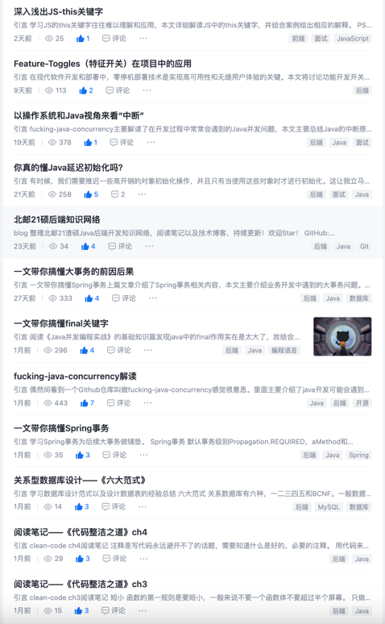
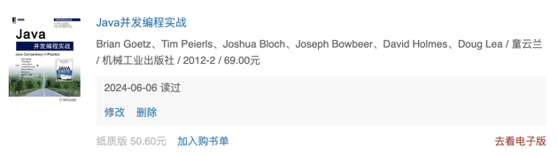
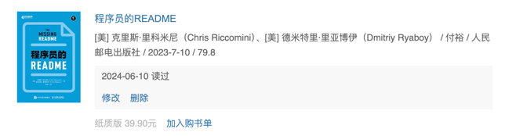
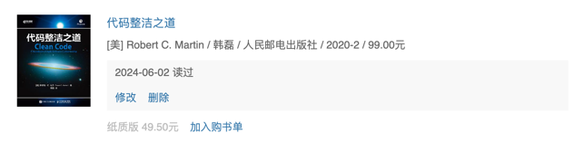
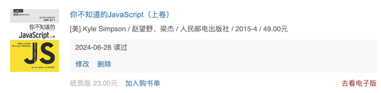
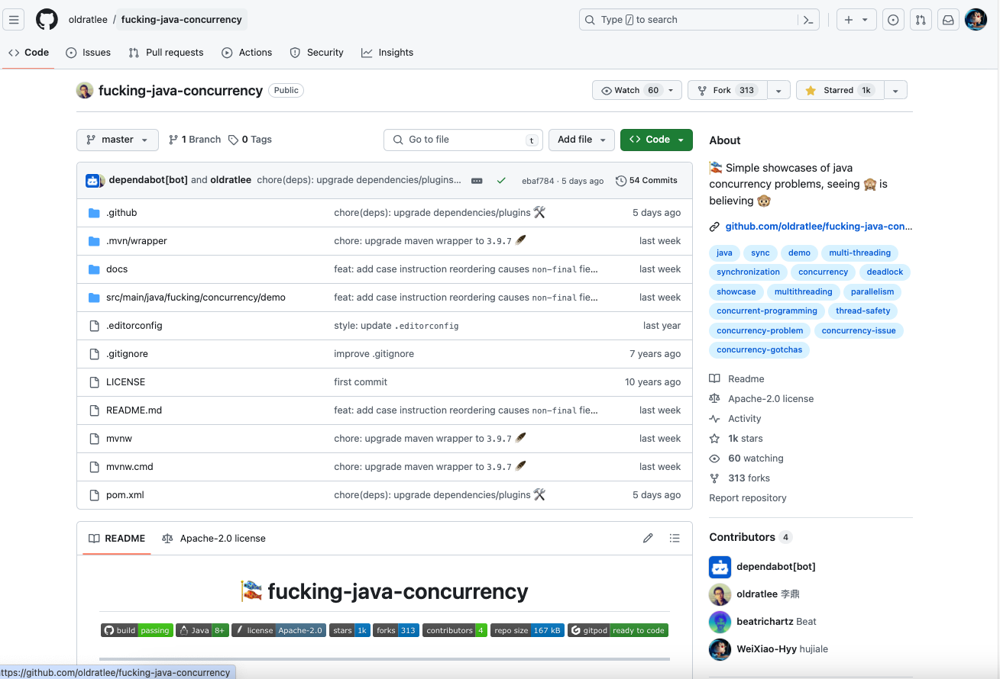

## 引言

时间过的好快，转眼间就要从北邮毕业了，距离上一次月度总结又过去了两个月，故作本次总结。

PS: [https://github.com/WeiXiao-Hyy/blog](https://github.com/WeiXiao-Hyy/blog)整理了后端开发的知识网络，欢迎Star！

## 毕业🎓

6月1号完成了自己的毕业答辩，马上就要跟学生时代的自己告别了，想想还是觉得有点舍不得。现在的我还是一个充满了学生思维的学生，一想到工作之后就要开始"装大人"了，既有些焦虑也有些期待。

## 旅行✈️

先后去了山西，西安，青甘大环线，泰国，内蒙五个地方，5月的时候80%的时间都是在外面度过的，总结来说就是累并快乐着。

## 博客📚

博客一共写了12篇，目标是一周2篇，距离目标还是差了4篇，希望未来能够继续保持更新！💪

## 阅读

虽然一直在外面玩，但是读书的心一直没有放下，把很多经典的书籍都重新读了一遍，要努力完成一年12本+的阅读量。

第一本就是这本并发经典图书，研一的时候其实就打算阅读，但是当时也是没有学Java多久，很多东西都看不太懂。这次再翻开的时候有一种豁然开朗的感觉，通读下来基本上没有多的障碍，有一些个人感觉翻译不太通顺的地方阅读了英文原版后也比较简单搞懂。

第二本读的很快，读了7天就读完了，很庆幸地是在蚂蚁实习的时光能够让我很快读懂书中介绍的相关开发规范以及如何在步入职场初期快速提升自己，这也是唯一一本我见过教你如何做一名on-call人员的技术书籍。当然了作者是国外的程序员，很多场景其实过于理想化了，书中有一些翻译比较生硬，建议相关章节可以读一下英文原版。推荐给刚刚步入职场跟我一样的程序员们。

PS: [Maker's Schedule, Manager's Schedule](https://paulgraham.com/makersschedule.html)这是书中推荐加油站部分的文章，读完感受很深，能够让我更加享受一整块的时间。

第三本是Bob大叔的经典之作了，前面几章我也有写过知识碎片。前面章节讲的知识点和问题在日常生产中也能常常遇见，后面的实战部分还没有看完，后面编程时的建议有很多但是感觉很难在实战中都能一一运用（看来还是看的以及写的不够多）。

第四本是一本JS的书籍，在学习后端的同时，我也有学习前端的知识，一直努力着能够做出一个属于自己的产品（目前是先做了几个小APP练手项目）希望熟练掌握JS和TS语言，走TS全栈路线。

## PR

偶然间看到一个Github仓库叫做[fucking-java-concurrency](https://github.com/oldratlee/fucking-java-concurrency/tree/master)感觉很意思。里面主要介绍了java开发可能会遇到的并发问题。并且结合了上面学习的《Java并发编程实战》的内容给仓库提了一个final关键字的例子并且顺利地被大佬merge进去了，还是比较开心的，希望后续能多关注开源社区努力学习优秀的开源项目。

## 生活

感情上比3-4月感觉要稳定了许多，其实有些时候感觉还是需要去花点时间去阅读书籍去了解一下什么是亲密关系以及两性关系。尝试做到以下几点：

1. 学会倾听，不要尝试改变对方的情绪；
2. 遇到烦心事不要表现得过于明显，保持充足的睡眠；
3. 理解激素对女性日常情绪的影响，在大姨妈期间多关注对方包容对方的情绪（虽然每次姨妈都要吵架）；

下个月8号就要跟女朋友离开北京去另一座城市一起生活了，我对未来跟她的生活充满了期待和向往，希望我们能相互扶持并走到最后。

## 计划

### 阅读

1. 读完《软技能》目前认为比较重要的内容
2. 读完《代码整洁之道》后2章节的内容
3. 读完《微服务架构设计模式》后面6章的内容
4. 读完《System Interview》
5. 重读《Effective Java》

### 工作

下个月8号就要入职蚂蚁集团，希望能够顺利landing，并且能够快速提升自己的技术影响力，保持对技术的热情。

## 祝福

祝读到最后的朋友们，生活幸福，事业顺利，能够在程序员的道路上越走越远！
---
theme: github
highlight: github
---
## 引言

时间过的好快，转眼间就要从北邮毕业了，距离上一次月度总结又过去了两个月，故作本次总结。

PS: [https://github.com/WeiXiao-Hyy/blog](https://github.com/WeiXiao-Hyy/blog)整理了后端开发的知识网络，欢迎Star！

## 毕业🎓

6月1号完成了自己的毕业答辩，马上就要跟学生时代的自己告别了，想想还是觉得有点舍不得。现在的我还是一个充满了学生思维的学生，一想到工作之后就要开始"装大人"了，既有些焦虑也有些期待。

## 旅行✈️

先后去了山西，西安，青甘大环线，泰国，内蒙五个地方，5月的时候80%的时间都是在外面度过的，总结来说就是累并快乐着。

## 博客📚

博客一共写了12篇，目标是一周2篇，距离目标还是差了4篇，希望未来能够继续保持更新！💪

## 阅读

虽然一直在外面玩，但是读书的心一直没有放下，把很多经典的书籍都重新读了一遍，要努力完成一年12本+的阅读量。

第一本就是这本并发经典图书，研一的时候其实就打算阅读，但是当时也是没有学Java多久，很多东西都看不太懂。这次再翻开的时候有一种豁然开朗的感觉，通读下来基本上没有多的障碍，有一些个人感觉翻译不太通顺的地方阅读了英文原版后也比较简单搞懂。

第二本读的很快，读了7天就读完了，很庆幸地是在蚂蚁实习的时光能够让我很快读懂书中介绍的相关开发规范以及如何在步入职场初期快速提升自己，这也是唯一一本我见过教你如何做一名on-call人员的技术书籍。当然了作者是国外的程序员，很多场景其实过于理想化了，书中有一些翻译比较生硬，建议相关章节可以读一下英文原版。推荐给刚刚步入职场跟我一样的程序员们。

PS: [Maker's Schedule, Manager's Schedule](https://paulgraham.com/makersschedule.html)这是书中推荐加油站部分的文章，读完感受很深，能够让我更加享受一整块的时间。

第三本是Bob大叔的经典之作了，前面几章我也有写过知识碎片。前面章节讲的知识点和问题在日常生产中也能常常遇见，后面的实战部分还没有看完，后面编程时的建议有很多，但是感觉很难在实战中都能一一运用（看来还是看的以及写的不够多）。

第四本是一本JS的书籍，在学习后端的同时，我也有学习前端的知识，一直努力着能够做出一个属于自己的产品（目前是先做了几个小APP练手项目）希望熟练掌握JS和TS语言，走TS全栈路线。

## PR

偶然间看到一个Github仓库叫做[fucking-java-concurrency](https://github.com/oldratlee/fucking-java-concurrency/tree/master)感觉很意思。里面主要介绍了java开发可能会遇到的并发问题。并且结合了上面学习的《Java并发编程实战》的内容给仓库提了一个final关键字的例子并且顺利地被大佬merge进去了，还是比较开心的，希望后续能多关注开源社区努力学习优秀的开源项目。

## 生活

感情上比3-4月感觉要稳定了许多，其实有些时候感觉还是需要去花点时间去阅读书籍去了解一下什么是亲密关系以及两性关系。尝试做到以下几点：

1. 学会倾听，不要尝试改变对方的情绪；
2. 遇到烦心事不要表现得过于明显，保持充足的睡眠；
3. 理解激素对女性日常情绪的影响，在大姨妈期间多关注对方包容对方的情绪（虽然每次姨妈都要吵架）；

下个月8号就要跟女朋友离开北京去另一座城市一起生活了，我对未来跟她的生活充满了期待和向往，希望我们能相互扶持并走到最后。

## 计划

### 阅读

1. 读完《软技能》目前认为比较重要的内容
2. 读完《代码整洁之道》后2章节的内容
3. 读完《微服务架构设计模式》后面6章的内容
4. 读完《System Interview》
5. 重读《Effective Java》

### 工作

下个月8号就要入职蚂蚁集团，希望能够顺利landing，并且能够快速提升自己的技术影响力，保持对技术的热情。

## 祝福

祝读到最后的朋友们，生活幸福，事业顺利，能够在程序员的道路上越走越远！